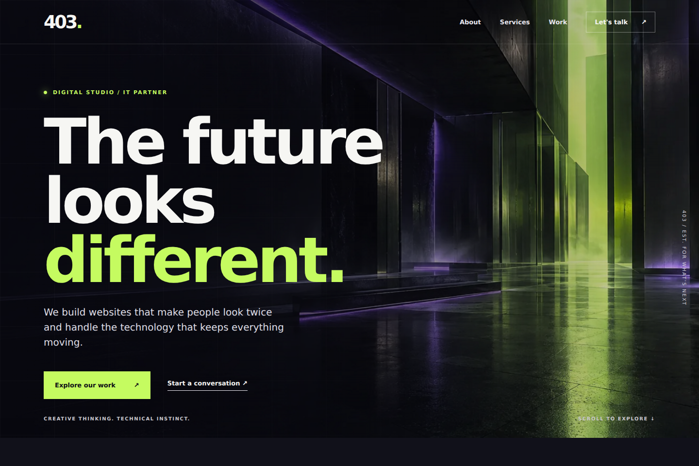
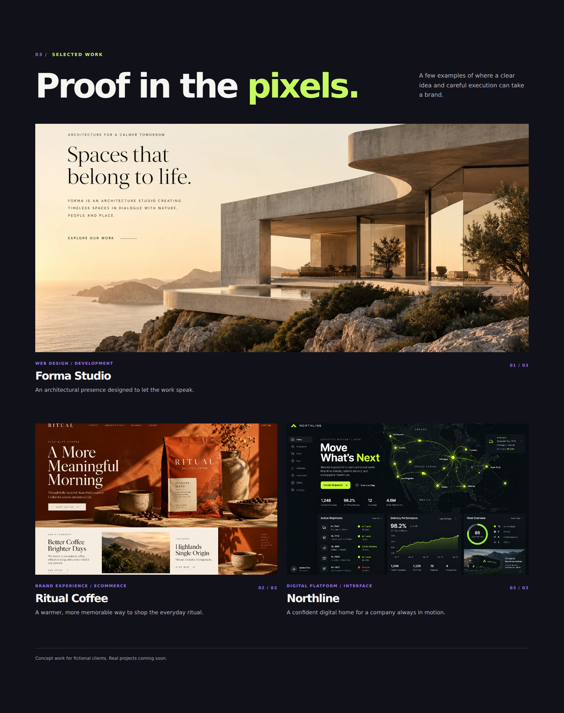
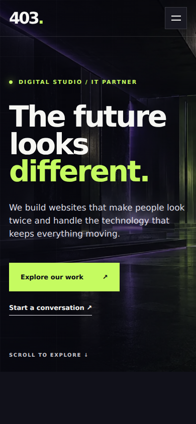
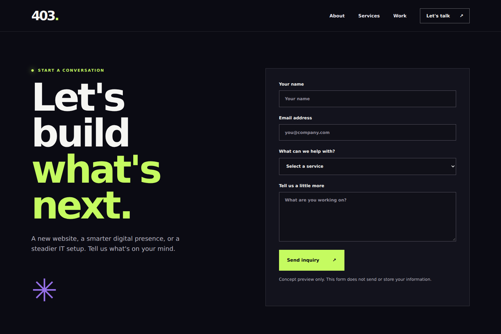

<div align="center">

# 403. Studio

### Digital built differently.

A bold, responsive website concept for a studio bringing **custom websites** and **IT services** under one roof.


[Preview](#preview) · [Run locally](#run-locally) · [Explore the site](#explore-the-site) · [Customize](#customize)



</div>

## The idea

**Good design. Solid systems.** 403 pairs a creative agency feel with a practical technology focus: oversized typography, a dark palette, purple lighting, and lime accents. The site introduces the studio, explains its services, and gives visitors a visual route through three concept projects.

Built with plain **HTML, CSS, and JavaScript**. No framework, package installation, database, or compilation is required.

## Preview

### Selected work



<table>
<tr><th>Mobile homepage</th><th>Contact page</th></tr>
<tr>
<td align="center"></td>
<td align="center"></td>
</tr>
</table>

Screenshots show this site's actual pages. The imagery inside the fictional project examples is generated concept artwork.

## Features

- **Responsive layouts** for desktop and mobile, with a collapsible mobile menu.
- **Studio homepage** with an introduction, service cards, selected work, and contact links.
- **Three project pages** for Forma Studio, Ritual Coffee, and Northline.
- **Scroll reveals and hover effects**, with reduced-motion styling.
- **Keyboard-friendly details** including skip links, visible focus indicators, and Escape-to-close navigation.
- **Local WebP imagery** and an SVG favicon.
- **Contact form preview** with browser validation and an explicit demo message.

> **Concept status:** The showcased clients and projects are fictional. The contact form does not send or store messages; submitting it displays “This is a preview form. No message was sent.”

## Run locally

### Option 1 — Open it directly

The fastest way to see the site requires only a modern browser:

1. At the top of [this repository](https://github.com/Matthew-Hawk/Build_403), select **Code → Download ZIP**.
2. Extract the ZIP into a folder. Keep the HTML files, stylesheet, script, and `assets` folder together.
3. Open `index.html` in Chrome, Edge, Firefox, or Safari.
4. Use the navigation and project cards to explore the other pages.

There is no installer. The site runs in your browser.

### Option 2 — Serve it on localhost

Use this option to preview the site through a local web server.

**You need:** [Git](https://git-scm.com/downloads) to clone the repo and [Python 3](https://www.python.org/downloads/) to serve it. You can also use the extracted ZIP from Option 1 instead of Git.

Clone the repository and enter its folder:

```sh
git clone https://github.com/Matthew-Hawk/Build_403.git
cd Build_403
```

Start the server using the command for your system:

**Windows — PowerShell or Command Prompt**

```powershell
py -m http.server 8000 --bind 127.0.0.1
```

**macOS / Linux — Terminal**

```sh
python3 -m http.server 8000 --bind 127.0.0.1
```

Open **[http://localhost:8000](http://localhost:8000)** in your browser. Leave the terminal running while you browse; press **Ctrl+C** to stop the server.

<details>
<summary><strong>Quick troubleshooting</strong></summary>

- **Python command not found:** Install Python 3. If your installation uses `python` instead of `py` or `python3`, run `python -m http.server 8000 --bind 127.0.0.1`.
- **A directory listing appears:** Start the server inside `Build_403`, where `index.html` is located.
- **Port 8000 is already in use:** Replace `8000` with `8080` in the server command and visit `http://localhost:8080`.
- **Images or styles are missing:** Extract the whole ZIP, retain the `assets` folder, and keep the original relative paths.

</details>

## Explore the site

With the local server running:

| Page | What you'll find | Local address |
| :--- | :--- | :--- |
| Home | Hero, studio introduction, services, and selected work | [Home](http://localhost:8000/) |
| Forma Studio | Fictional architecture website concept | [Forma](http://localhost:8000/forma.html) |
| Ritual Coffee | Fictional coffee brand and storefront concept | [Ritual](http://localhost:8000/ritual.html) |
| Northline | Fictional logistics platform concept | [Northline](http://localhost:8000/northline.html) |
| Contact | Inquiry form preview | [Contact](http://localhost:8000/contact.html) |

The project pages present concept case studies; the storefront and dashboard pictured in the artwork are illustrative visuals.

## Project structure

| File / folder | Purpose |
| :--- | :--- |
| `index.html` | Main landing page |
| `forma.html`, `ritual.html`, `northline.html` | Individual concept project pages |
| `contact.html` | Demo inquiry form |
| `style.css` | Shared styles, theme variables, and responsive layouts |
| `script.js` | Mobile menu, scroll reveals, copyright year, and demo form behavior |
| `assets/` | Hero and project WebP images, plus the SVG favicon |
| `docs/screenshots/` | Screenshots used in this README |

## Customize

**Copy and content:** Edit the relevant HTML page. Replace the fictional project descriptions with your own work when ready.

**Brand colors:** Update the variables in the `:root` block of `style.css`:

```css
--ink: #0b0b13;
--lime: #c5fb60;
--purple: #9670e8;
```

**Images:** Replace the files in `assets/`, keeping their filenames, or update the references in the HTML and CSS. The hero background is referenced in `style.css`.

**Contact submissions:** Connect a real form endpoint or service before accepting inquiries. Update the demo submit handler in `script.js` and the preview notices in `contact.html` to reflect the actual submission behavior.

## Hosting

The site consists of static files and can be served by a static hosting provider. Keep `index.html` at the published root and upload the HTML pages, `style.css`, `script.js`, and `assets/` together. There is no application build command or server-side runtime.

---

<div align="center">

**Creative thinking. Technical instinct.**

[Matthew Hawkins](https://github.com/Matthew-Hawk) · [Build_403](https://github.com/Matthew-Hawk/Build_403)

</div>
